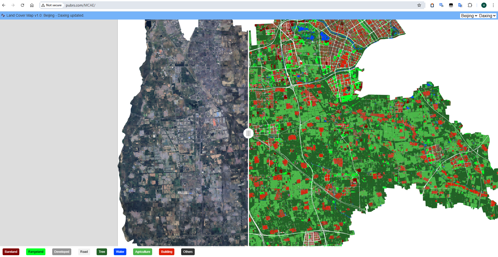
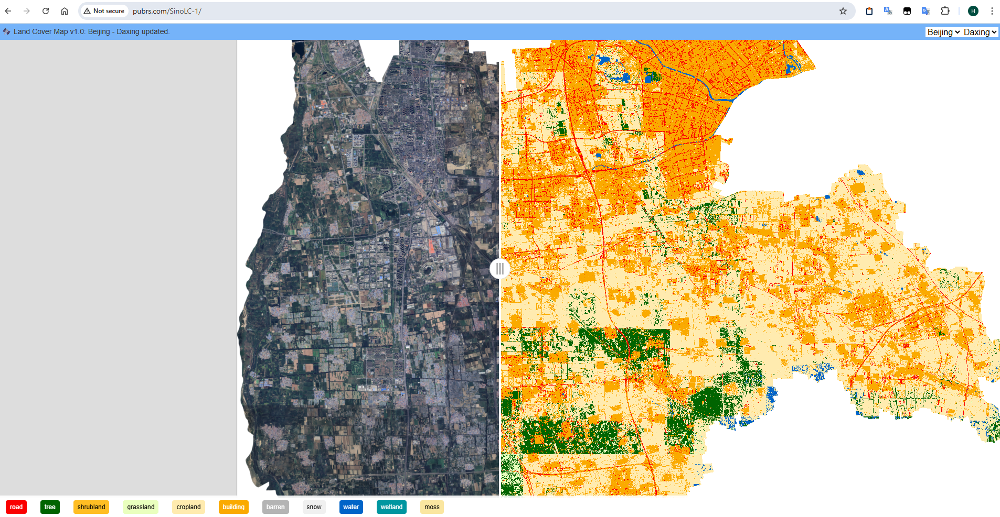
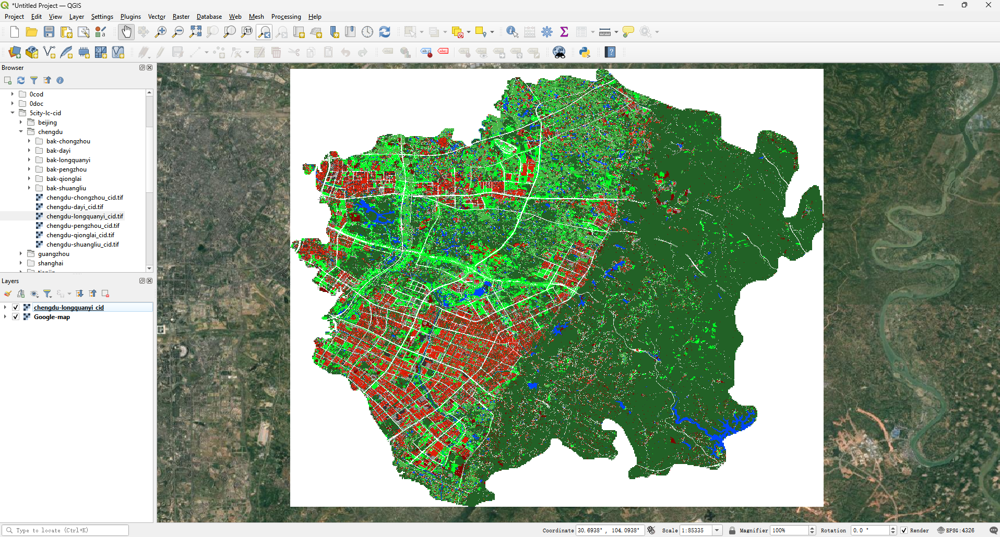

# Mapping result display and comparison:

- 0.6-meter MCAE-based land cover maps: [http://pubrs.com/](http://pubrs.com/)  or [http://pubrs.com/MCAE/](http://pubrs.com/MCAE/)

- 1-meter SinoLC-1 land cover maps: [http://pubrs.com/SinoLC-1/](http://pubrs.com/SinoLC-1/)

Note: The website bandwidth is limited, please be patient and wait for the loading time to arrive.

# 0.6-meter MCAE-based land cover maps for five cities in China：

- Download the MCAE-based Land Cover Map and open it directly in QGIS. The color palette has already been embedded in the land cover map.

- Download link for the MCAE-based Land Cover Map (continuously updated):
Baidu Netdisk: [https://pan.baidu.com/s/12xqWm1v8uXJszY4rNUd8pg?pwd=448w](https://pan.baidu.com/s/12xqWm1v8uXJszY4rNUd8pg?pwd=448w) Extraction Code: 448w

# 0.6-meter dense mask annotations for cities in China：

